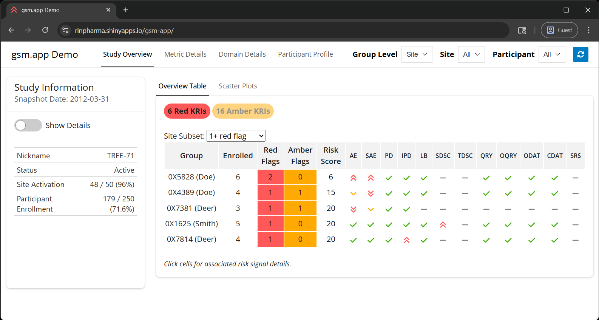
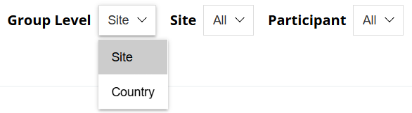
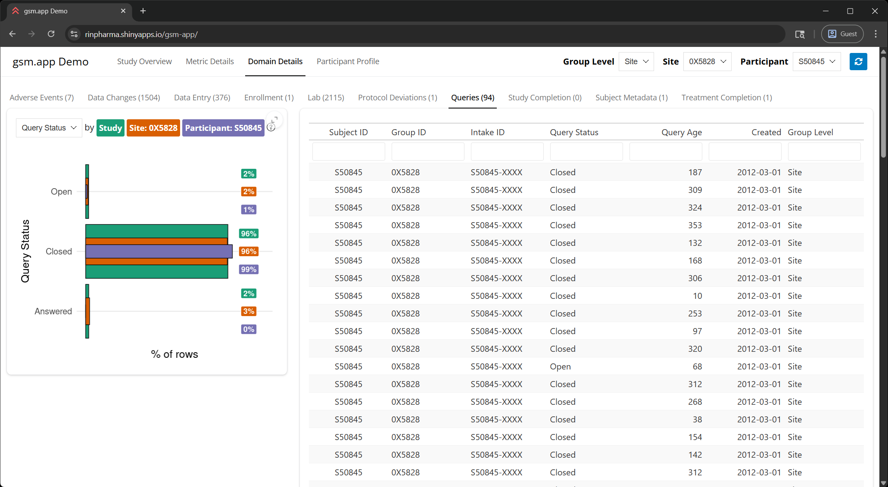

# What's the problem?

## {gsm.app} creates shiny apps for exploring clinical trial data

[{width="85%"}](https://rinpharma.shinyapps.io/gsm-app/)

## {gsm.app} inputs cascade



Groups & Participants can be temporarily invalid

## Changing {gsm.app} inputs can trigger bad loads

:::: columns
::: {.column width="65%"}
[](https://rinpharma.shinyapps.io/gsm-app/)
:::
::: {.column .emoji width="35%"}
- 🔃 Data loads based on inputs
- 🐢 Can be *very* slow
- ⚠️ Loading with invalid inputs can error
:::
::::

::: notes
- I can't actually trigger an error anymore to demo, unfortunately!
:::

## You can't safely set cascade order

Advice: "Set priority to infinity"

```{r}
#| code-line-numbers: "3"
shiny::observe(
  ...,
  priority = Inf
)
```

::: incremental
- What happens with competing `Inf`s?
- Live example: [Cascading inputs article](https://chains.shinyworks.org/articles/cascading_inputs.html)
:::

::: notes
- gsm.app allows for plugins that can change/react to inputs, can't know what all has `Inf`.
:::

# How does {chains} solve this problem?

## `validated_reactive_val()` creates self-validating reactives

```{r}
my_vrv <- chains::validated_reactive_val(
  {validation_expr},
  value = {starting_value},
  default = {value_if_invalid},
  ...
)
```

- Args include a `shiny::reactive()` for validation
- Call it like a `shiny::reactiveVal()`
  - `my_vrv("new_value")` to set a value
  - `my_vrv()` *always* returns a valid value

## `vrv_fct_scalar()` specifically solves the cascading input problem

```{r}
chains::vrv_fct_scalar(
  {allowed_levels},
  value = {initial_value},
  default = {value_if_invalid},
  ...
)
```

Other `vrv` helpers: 

::: compact
- `vrv_chr()` / `vrv_chr_scalar()`
- `vrv_dbl()` / `vrv_dbl_scalar()`
- `vrv_int()` / `vrv_int_scalar()`
- `vrv_lgl()` / `vrv_lgl_scalar()`
:::

# When will this be on CRAN?

## {chains} depends on {stbl}

| “Be conservative in what you send. Be liberal in what you accept from others.”
| [—[Postel's Law](https://en.wikipedia.org/wiki/Robustness_principle)]{.right}

- [{stbl} (stbl.wrangle.zone)](http://stbl.wrangle.zone/) "stabilizes" function arguments
- Used for `vrv_*()` + error messages
- {chains} requires features from {stbl} v0.3.0
  - [v0.2.0 on CRAN](https://cran.r-project.org/package=stbl)
  - I'm actively working on {stbl} v0.3.0

## I haven't really used {chains}!

- Refactoring {gsm.app} with {chains} will require **a lot** of deletion
- Need {chains} on CRAN before I can officially do that
- Hope to try it out on a branch ~soon

## You can help!

If you have a project that could use {chains}, try it out!

```{r}
# install.packages("pak")
pak::pak("shinyworks/chains")
```

Tell me about your experience at [github.com/shinyworks/chains](https://github.com/shinyworks/chains/issues)
